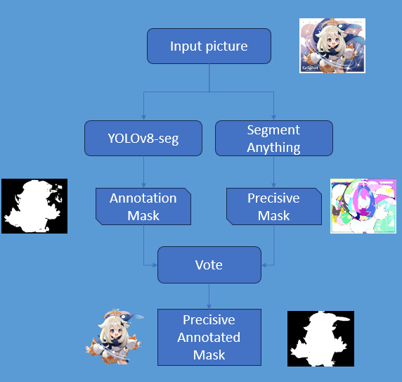
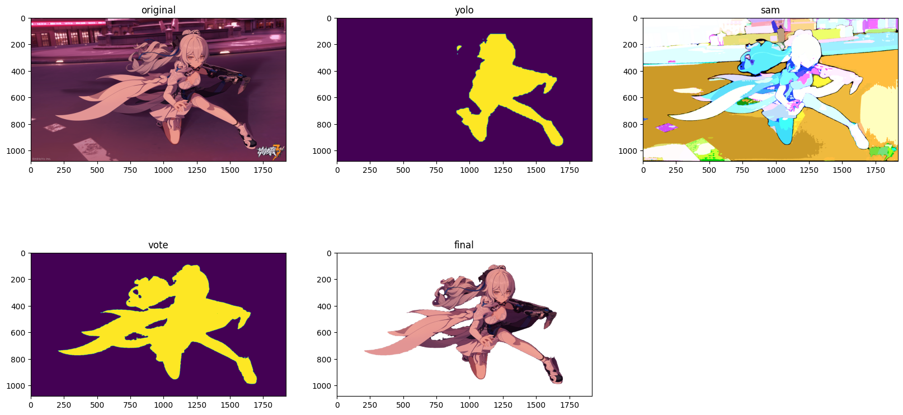

# Anime-seg-yolov8 project for CS308 Computer Vision
A segmentation project based on aniseg, trained on yolov8-seg

使用Ani-Seg的训练集，通过组合前景、背景以产生训练集。使用ultralytics的yolov8-seg进行训练，通过结合yolov8-seg和SAM实现更加精准的表现



## Project works
1.实现了一个简单的数据集生成器，可以通过组合前景、背景以产生训练集

2.在基于ani-seg生成的训练集和coco2017(仅person)上训练了yolov8m-seg模型

3.实现yolov8 detect+segment anything细化边界的seg任务

### What can this repo do?
- Generate dataset
- Use pretrained model to detect and segment anime character

## Requirements
- 安装python>=3.8以及requirements.txt中的依赖
- 将Segment Anything模型放入./segany 文件夹中
- 将YOLOv8-seg模型放入 ./yolo 文件夹中

## 数据集生成
可以使用以下命令创建数据集：
```bash
python generate.py --fg path_to_foreground --bg path_to_background --out path_to_output --mask path_to_mask --max_item number_of_items --pic_num number_of_pictures
```
- fg: 含有前景图像的文件夹的路径。默认指向的是 ./datasets/fg 目录。
- bg: 含有背景图像的文件夹的路径。默认指向的是 ./datasets/bg 目录。
- out:用来保存生成图像的输出目录的路径。默认指向的是 ./datasets/out 目录。
- mask: 用来保存前景物体遮罩的文件夹的路径。默认指向的是 ./datasets/masks 目录。
- max_item: 一张背景图像上可以放置的前景物体的最大数量。默认设置为 8。
- pic_num: 要生成的图片的最大数量。默认设置为 1。
## 检测并分割动漫角色

使用命令行检测和分割动漫角色，如下：

```bash
python detect.py --source sample.jpg --threshold 0.3 --save_path ./seg_output --sam_model vit_l --yolo_model ./yolo/ver3.pt --cuda --mask --sam --yolo
```
各参数具体含义如下：

- source：输入图片的路径，默认为'sample.jpg'
- threshold：生成分割遮罩的阈值，默认为0.3
- save_path：保存结果的路径，默认为'./seg_output'
- sam_model：SAM模型，有 'vit_l', 'vit_h' 和 'vit_b' 三种可选，默认为 'vit_l'
- yolo_model：YOLO模型路径，默认为'./yolo/ver3.pt'
- cuda：如果需要使用cuda加速，加上此选项(显存占用非常高，请注意) 若使用CPU计算，一张图大约需要2分钟
- mask: 是否保存分割遮罩图片，默认为False
- sam: 是否保存sam分割结果图片，默认为False
- yolo: 是否保存yolo分割结果图片，默认为False


## 模型下载

- YOLOv8-seg:https://huggingface.co/AkitoP/Anime-yolov8-seg
- Segment Anything: https://github.com/facebookresearch/segment-anything
## Reference
- Segment Anything: https://github.com/facebookresearch/segment-anything
- YOLOv8: https://github.com/ultralytics/ultralytics
- anime-segmentation: https://github.com/SkyTNT/anime-segmentation
- semantic segment anything: https://github.com/fudan-zvg/Semantic-Segment-Anything
