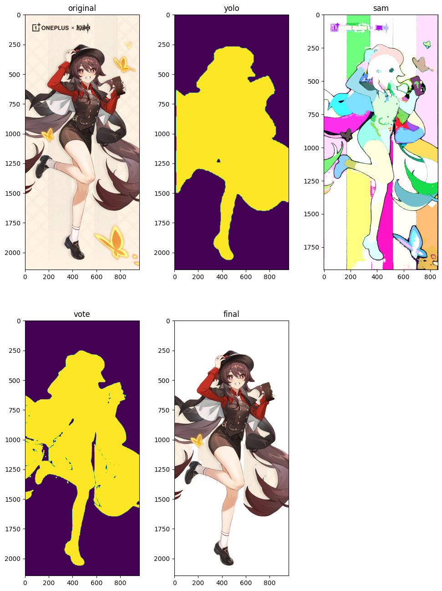

# YOUR TITLE HERE

**Student Name:** 
**Student ID:** 

## 1. Introduction

Our topic of interest is Semantic Segmentation, an essential task in computer vision that involves classifying each pixel in an image to a specific class, thus effectively understanding the scene at a pixel level. 

In the wake of the current trend of generating images with AI guided by Diffusion models, there is a growing need for more and better Anime image datasets for training AI painting models. However, due to the inefficiency of manual annotation and image segmentation, attention has shifted to semantic segmentation technology.

The latest generation of the YOLO (You Only Look Once) series [1], YOLOv8 [2], provides a powerful model for semantic segmentation along with related architecture. This innovation allows for the rapid training of high-quality models, enabling them to be implemented into practical applications quickly. This has opened new avenues in the realm of AI art creation, specifically within Anime image generation, presenting a compelling challenge in this area.

For our project, we utilized the Ani-seg training dataset, which provides anime character foreground and background to generate the training dataset. In addition, we incorporated the 'person' section from the COCO2017 training dataset. Finally, to strive for higher output precision, we employed the Segment-Anything [3] model.

首先，由YOLOv8-seg模型生成分割遮罩，然后使用Segment-Anything模型对分割遮罩进行细化，最后使用细化后的分割遮罩对原图进行分割。

## 2. Related works
Our project is primarily based on the YOLOv8 model, which is a state-of-the-art model used for object detection and tracking, instance segmentation, image classification, and pose estimation tasks. The model is designed to be fast, accurate, and easy to use. It can be utilized via Command Line Interface (CLI) or directly in a Python environment. YOLOv8 Detect, Segment and Pose models pretrained on the COCO dataset are available for use​​.

A critical dataset in our project is the anime-segmentation dataset by SkyTNT, which is expressly designed for anime character segmentation. This dataset consists of background images, foreground images with transparent backgrounds (anime characters), and real images with background and foreground. The data collection entailed sourcing the background from character_bg_seg_data, the foreground from the Danbooru website, and the real images and masks from AniSeg and the Danbooru website. To ensure that all foregrounds were indeed anime characters, the dataset underwent an initial cleaning with DeepDanbooru [4], followed by a manual process.

In addition to the anime-segmentation dataset, we also utilized the COCO2017 dataset, specifically leveraging the person segmentation annotations. The COCO2017 dataset is a large-scale object detection, segmentation, and captioning dataset, designed to push forward the advancement of object detection algorithms that can recognize objects in various contexts. Consisting of 118k training images, 5k validation images, and about 41k testing images, this dataset houses approximately 1.5 million object instances across 80 diverse categories. Importantly, this dataset not only provides bounding boxes for object detection but also pixel-wise segmentation masks for semantic understanding, thereby offering a rich understanding of the scene. This data serves as an instrumental tool in enhancing the YOLOv8 model's performance in anime character detection and segmentation tasks.

We referenced these projects in our process:
https://github.com/SkyTNT/anime-segmentation
https://github.com/jerryli27/AniSeg
https://github.com/Bing-su/adetailer

The model we use is:
https://github.com/ultralytics/ultralytics
## 3. Method

### 1) YOLOv8-seg Model Structure
The YOLOv8-Seg model is an extension of the YOLOv8 object detection model that also performs semantic segmentation of the input image. The backbone of the YOLOv8-Seg model is a CSPDarknet53 feature extractor, which is followed by a novel C2f module instead of the traditional YOLO neck architecture. The C2f module is followed by two segmentation heads, which learn to predict the semantic segmentation masks for the input image. The model has similar detection heads to YOLOv8, consisting of five detection modules and a prediction layer. The YOLOv8-Seg model has been shown to achieve state-of-the-art results on a variety of object detection and semantic segmentation benchmarks while maintaining high speed and efficiency​1​.

### 2) Training
We trained the YOLOv8m-seg model on the combined training set for 60 epochs, equivalent to 20 V100 hours.

### 3) Segmentation
We first used the YOLOv8m-seg model to segment the test images, obtaining segmentation masks. Then, we used the Segment Anything model for full-image semantic segmentation on the test images, obtaining all semantic segments (due to memory limitations, images larger than 1920pix were resized to below 1920pix before being given to Segment Anything). Finally, we extracted all semantic segments with an IoU greater than a threshold (set to 0.3) with the YOLO segmentation mask to get an interim segmentation result. Notably, as there are many blocks that Segment Anything does not recognize, we took the intersection of all the unmarked background areas with the YOLO segmentation mask, then combined this with the interim segmentation result from the previous step to get the final segmentation result. To prevent the YOLO segmentation mask from being too large and retaining the background of the boundary that should be discarded, we eroded the YOLO segmentation mask first and then performed the operation from the previous step. Finally, we obtained the final segmentation results​2​.
## 4. Experiments
### 4.1 Datasets
The anime-segmentation training set provides 11,789 transparent background png images of pure anime characters (referred to as fg), and 8,057 anime background images (referred to as bg). First, we used a straightforward pasting method to randomly paste the fg images one-to-one onto the bg, generating 11,789 simple training images along with their corresponding YOLO format annotations. Then, on this basis, we used a method of multiple fgs corresponding to a single bg, pasted several fgs after scaling, rotation, color processing, and random cropping onto the bg, and then added random noise, generating 15,772 training images and their corresponding YOLO format annotations. Finally, we used 64,115 images from the COCO2017 training set that contained person class annotations, and converted their annotation format to YOLO format. We merged these three datasets to get 91,676 training images and their corresponding YOLO format annotations.
### 4.2 Implementation Details
The following are the implementation details of the models used:

YOLOv8-seg Model
The YOLOv8-seg model was trained using the code provided by Ultralytics. The COCO2017 pretrained model of YOLOv8m-seg was used as the base model. The batch size and optimizer (which is likely AdamW) were automatically adjusted by Ultralytics (with the final batch size being 25). The learning rate was set to 1e-2, momentum to 0.937, and weight decay to 5e-4, while dropout was set to 0. Other parameters were left at their default values.

Segment Anything Model
The Segment Anything model was implemented using ViT_L. The SamAutomaticMaskGenerator was used with the parameters pred_iou_thresh=0.6, stability_score_thresh=0.8, crop_n_points_downscale_factor=1, and crop_n_layers=1. Due to memory constraints, images were resized to be less than or equal to 1920 pixels along their longest dimension before being passed through the Segment Anything model.

Before voting, the mask output from the YOLO model was eroded with a radius of 2 pixels for 3 iterations, and then dilated with a radius of 2 pixels for 2 iterations. Given that the YOLO mask has a fixed longest side of 640 pixels, this erosion and dilation process can be considered equivalent to a 2-3 times operation. During voting, an Intersection over Union (IoU) threshold of 0.3 was used.

### 4.3 Metrics
#### 1. YOLO val
Metrics used for the evaluation of the YOLO model include Precision (Box(P)), Recall (R), mean Average Precision at 50% Intersection over Union (mAP50), and mAP from 50% to 95% IoU (mAP50-95) for both bounding box and mask predictions. These metrics were used to evaluate several configurations of the model including the base COCO2017 pretrained model, a version trained on Ani-seg's simple dataset for 200 epochs (YOLOv8m-seg@200epochs), a version trained on Ani-seg's enhanced dataset for 100 epochs (YOLOv8n-seg@100epochs), and a version trained on a combination of Ani-seg's simple and enhanced datasets and the COCO2017 person class for 60 epochs (YOLOv8m-seg@60epochs).
#### 2. Human Evaluation of Output Quality
The quality of the output was further evaluated by humans. This was done by using the Segment Anything model with VIT_L for the entire pipeline and visually inspecting the resulting outputs. The Segment Anything model was noted to significantly refine the mask output from the YOLO model, even completing parts that the YOLO model was unable to mask. This indicates that our pipeline design is effective and the output quality is satisfactory.

### 4.4 Experimental design & results
#### 1. A set of 944 anime images were used as the test dataset for model evaluation, yielding the following results:
| Model | Box(P) | R | mAP50 | mAP50-95 | Mask(P) | R | mAP50 | mAP50-95 |
| ----- | ------ | - | ----- | -------- | ------- | - | ----- | -------- |
| COCO2017 Pretrained Model | 0.84 | 0.525 | 0.65 | 0.558 | 0.863 | 0.506 | 0.637 | 0.502 |
| YOLOv8m-seg@200epochs with Ani-seg Simple Dataset | 0.954 | 0.803 | 0.908 | 0.819 | 0.931 | 0.84 | 0.918 | 0.789 |
| YOLOv8n-seg@100epochs with Ani-seg Enhanced Dataset | 0.902 | 0.901 | 0.951 | 0.798 | 0.909 | 0.891 | 0.944 | 0.718 |
| YOLOv8m-seg@60epochs with Ani-seg Simple + Enhanced Dataset + COCO2017 Person Class | 0.961 | 0.956 | 0.983 | 0.899 | 0.963 | 0.958 | 0.984 | 0.825 |

As can be seen, data augmentation provides a measurable improvement to the model's segmentation capabilities. Additionally, the incorporation of the concept of a "human" from the COCO2017 dataset also enhances the model's ability to segment, even if the subjects are not anime characters.

#### 2.We used the Segment Anything model with VIT_L for the entire pipeline, resulting in the following outputs:

As can be seen, the Segment Anything model has significantly refined the mask output from the YOLO model, even completing parts that the YOLO model was unable to mask. This indicates that our pipeline design is effective.
## 5. Conclusion
(What challenge you tackle with what method? How well your method is?)

## Reference
[1] Jiang, P., Ergu, D., Liu, F., Cai, Y., & Ma, B. (2022). A Review of Yolo algorithm developments. *Procedia Computer Science*, *199*, 1066-1073.

[2] Kim, J. H., Kim, N., & Won, C. S. (2023, June). High-Speed Drone Detection Based On Yolo-V8. In *ICASSP 2023-2023 IEEE International Conference on Acoustics, Speech and Signal Processing (ICASSP)* (pp. 1-2). IEEE.

[3] Kirillov, A., Mintun, E., Ravi, N., Mao, H., Rolland, C., Gustafson, L., ... & Girshick, R. (2023). Segment anything. *arXiv preprint arXiv:2304.02643*.

[4] Taha, M. M., Alsammak, A. K., & Zaky, A. B. (2023). InspectorNet: Transformer network for violence detection in animated cartoon. *Engineering Research Journal-Faculty of Engineering (Shoubra)*, *52*(2), 114-119.

[5] SkyTNT. 2023. Anime-segmentation. https://github.com/SkyTNT/anime-segmentation.

[6] Jerry Li, Tazik Shahjahan. 2020. AniSeg. https://github.com/jerryli27/AniSeg.

[7] Glenn Jocher,ultralytics. 2023. Ultralytics. https://github.com/ultralytics/ultralytics.

[8] Bing-su. 2023. Adetailer. https://github.com/Bing-su/adetailer.

## Contributions
- **Name1 (SID1):**
- **Name2 (SID2):**
- **Name3 (SID3):**
