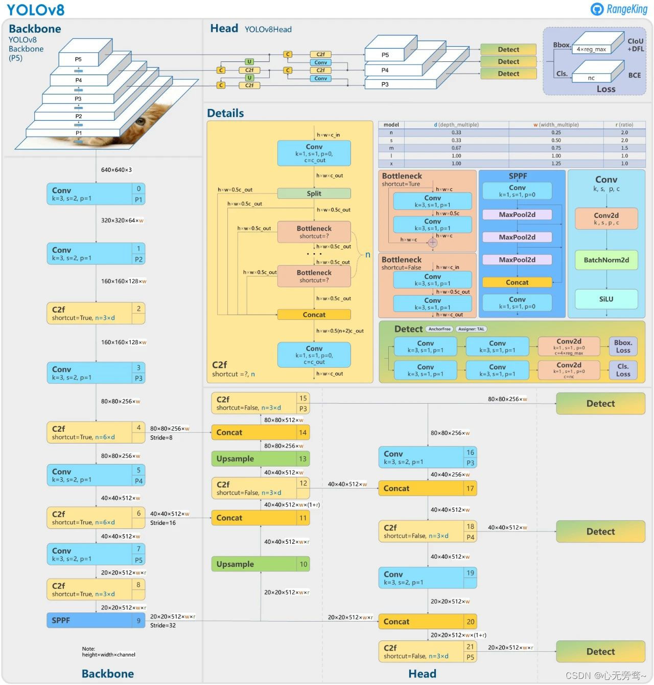

# YOUR TITLE HERE

**Student Name:** 刘宗尧, 罗世杰, 郗志豪
**Student ID:** 12011903, SID2, SID3

## 1. Introduction

Our topic of interest is Semantic Segmentation, an essential task in computer vision that involves classifying each pixel in an image to a specific class, thus effectively understanding the scene at a pixel level. 

In the wake of the current trend of generating images with AI guided by Diffusion models, there is a growing need for more and better Anime image datasets for training AI painting models. However, due to the inefficiency of manual annotation and image segmentation, attention has shifted to semantic segmentation technology.

The latest generation of the YOLO (You Only Look Once) series, YOLOv8, provides a powerful model for semantic segmentation along with related architecture. This innovation allows for the rapid training of high-quality models, enabling them to be implemented into practical applications quickly. This has opened new avenues in the realm of AI art creation, specifically within Anime image generation, presenting a compelling challenge in this area.

For our project, we utilized the Ani-seg training dataset, which provides anime character foreground and background to generate the training dataset. In addition, we incorporated the 'person' section from the COCO2017 training dataset. Finally, to strive for higher output precision, we employed the Segment-Anything model.

## 2. Related works
Our project is primarily based on the YOLOv8 model, which is a state-of-the-art model used for object detection and tracking, instance segmentation, image classification, and pose estimation tasks. The model is designed to be fast, accurate, and easy to use. It can be utilized via Command Line Interface (CLI) or directly in a Python environment. YOLOv8 Detect, Segment and Pose models pretrained on the COCO dataset are available for use​​.

A critical dataset in our project is the anime-segmentation dataset by SkyTNT, which is expressly designed for anime character segmentation. This dataset consists of background images, foreground images with transparent backgrounds (anime characters), and real images with background and foreground. The data collection entailed sourcing the background from character_bg_seg_data, the foreground from the Danbooru website, and the real images and masks from AniSeg and the Danbooru website. To ensure that all foregrounds were indeed anime characters, the dataset underwent an initial cleaning with DeepDanbooru, followed by a manual process.

In addition to the anime-segmentation dataset, we also utilized the COCO2017 dataset, specifically leveraging the person segmentation annotations. The COCO2017 dataset is a large-scale object detection, segmentation, and captioning dataset, designed to push forward the advancement of object detection algorithms that can recognize objects in various contexts. Consisting of 118k training images, 5k validation images, and about 41k testing images, this dataset houses approximately 1.5 million object instances across 80 diverse categories. Importantly, this dataset not only provides bounding boxes for object detection but also pixel-wise segmentation masks for semantic understanding, thereby offering a rich understanding of the scene. This data serves as an instrumental tool in enhancing the YOLOv8 model's performance in anime character detection and segmentation tasks.
## 3. Method
Two options:
- If you propose your own methods, describe here.
- If you are using methods that have been proposed, introduce the method with your own words (Don't copy & paste from the paper). Citation to the original paper is needed. Alternatively, if you make some improvement, highlight it and state them here.

1. 使用了YOLOv8-seg模型结构。（介绍YOLOv8-seg模型结构）
2. 实现了一种类似sematic segment anything的pipeline:由yolov8模型提供区域的标注，然后从segment anything中获取良好分割的mask，最后根据mask对yolov8的输出进行修正。这样可以有效地提高模型的分割精度。
## 4. Experiments
1. 对比了不同的数据集的效果：Aniseg、Aniseg(reinforced)、Aniseg(reinforced)+COCO2017
### 4.1 Datasets
1. 实现了一种混合生成数据集的方式：将Aniseg中的透明背景动漫角色图片经过旋转、平移、缩放、颜色变换等操作之后，叠加到Aniseg的背景上，然后对整体加噪。这样可以有效地增加数据集的多样性，提高模型的泛化能力。
2. 实现了一种混合训练的方式：将Aniseg和COCO2017的数据集混合，同时训练。由于Aniseg的数据集中只有1w张动漫角色，其泛化性并不高，而且模型似乎很难从Aniseg数据集中学到“人”的概念。因此，我们添加了COCO2017数据集中的“人”类别，这样可以有效地提高模型的泛化能力。
### 4.2 Implementation Details
How you implement your model. For example, the hyper-parameters you use, the deep learning framework you use, etc.
参数：
使用ultralytics提供的coco2017预训练yolov8m-seg模型，batch交给它自动调整（最终调整结果是bs=25），optimizer交给它自动调整(应该是AdamW)，dropout=0,lr=1e-2,momentum=0.937,weight_decay=5e-4，其余参数为默认值。
框架：
使用YOLOv8-seg模型，使用ultralytics的deep的代码进行训练。
### 4.3 Metrics
Briefly introduce the metrics you would use to assess your model performance in the experiments.

### 4.4 Experimental design & results
1.使用Ani-seg收集的1000张真实动漫图片作为测试集，对模型进行测试，得到如下结果：

## 5. Conclusion
(What challenge you tackle with what method? How well your method is?)

## Reference
[1] Jiang, P., Ergu, D., Liu, F., Cai, Y., & Ma, B. (2022). A Review of Yolo algorithm developments. *Procedia Computer Science*, *199*, 1066-1073.

[2] Kim, J. H., Kim, N., & Won, C. S. (2023, June). High-Speed Drone Detection Based On Yolo-V8. In *ICASSP 2023-2023 IEEE International Conference on Acoustics, Speech and Signal Processing (ICASSP)* (pp. 1-2). IEEE.

[3] Kirillov, A., Mintun, E., Ravi, N., Mao, H., Rolland, C., Gustafson, L., ... & Girshick, R. (2023). Segment anything. *arXiv preprint arXiv:2304.02643*.

[4] Taha, M. M., Alsammak, A. K., & Zaky, A. B. (2023). InspectorNet: Transformer network for violence detection in animated cartoon. *Engineering Research Journal-Faculty of Engineering (Shoubra)*, *52*(2), 114-119.

[5] SkyTNT. 2023. Anime-segmentation. https://github.com/SkyTNT/anime-segmentation.

[6] Jerry Li, Tazik Shahjahan. 2020. AniSeg. https://github.com/jerryli27/AniSeg.

[7] Glenn Jocher,ultralytics. 2023. Ultralytics. https://github.com/ultralytics/ultralytics.

[8] Bing-su. 2023. Adetailer. https://github.com/Bing-su/adetailer.

## Contributions
- **Name1 (SID1):**
- **Name2 (SID2):**
- **Name3 (SID3):**
